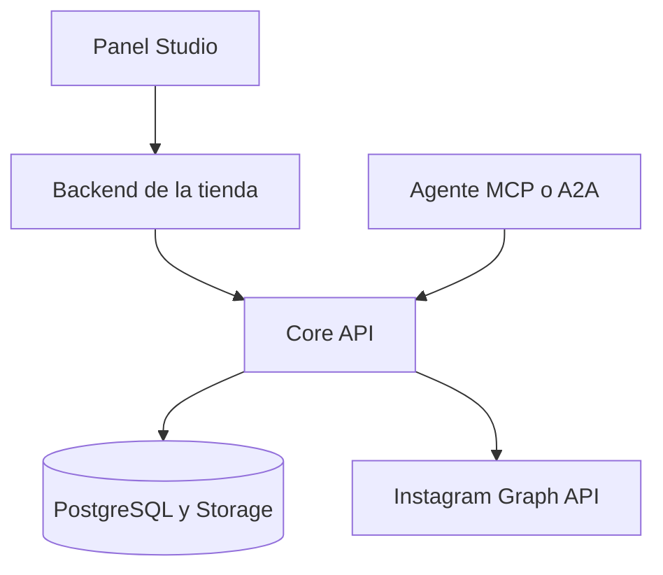

# Integrar Instagram Core en una plataforma

El módulo comparte una instancia de Core entre tiendas mediante `workspace_id` permanente. El panel de la tienda usa `mountInstagramStudio`; su backend comprueba sesión, rol y pertenencia, y despacha acciones con `executeStudioAction`. El backend sincroniza marca y productos reales mediante `InstagramProjectClient`.

| Dato | Origen | Requisito |
| --- | --- | --- |
| `workspace_id` | ID estable de tienda, prefijado por plataforma | Máximo 64 caracteres; letras, números, guion y guion bajo |
| `actor_id` | Usuario autenticado | Conservar en el token firmado de 15 minutos |
| `scopes` | Rol y permisos del host | `read`, `edit`, `approve`, `publish`, `accounts` |
| Marca y catálogo | Datos reales del host | Sincronizar cambios y productos seleccionados |
| Medios | Archivo elegido o URL HTTPS propia | Accesible para Meta al publicar |

El backend host guarda el bearer propietario y llama `InstagramAdminClient.forProject(workspaceId, actorId, scopes)`. El frontend llama sólo sus rutas de mismo origen, con protección CSRF según el sistema de sesión. El Core impide acceso cruzado en las rutas de proyectos; el host conserva la responsabilidad de verificar membresía y rol.

El ejemplo de montaje y despacho está en [README.md](../README.md#studio-en-el-panel). La migración y la verificación real están en [v1-release.md](v1-release.md). Las rutas del Core se enumeran en `.agents/skills/integrar-instagram-core/references/contract.md`.

La integración concreta en Conecta, World Case y Nanisports sigue pendiente hasta disponer de sus repositorios, sesiones, modelos de productos y permisos. El Studio muestra estilos, catálogo, archivos, borradores y cuentas; no renderiza una imagen promocional final a partir de productos.
